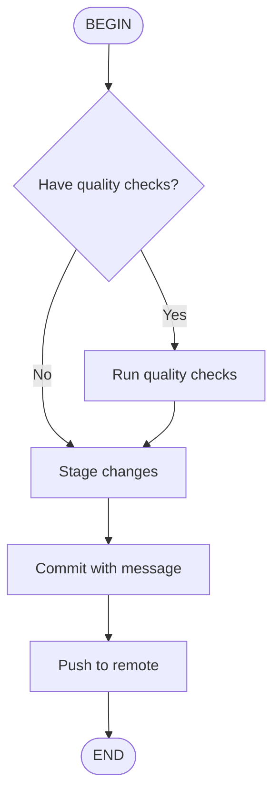

# `/skill:commit-push` — Commit & Push (Current Branch)

Ce skill guide le commit des changements et le push vers le repository distant.

## Prérequis

- Des fichiers ont été modifiés
- Le remote `origin` est configuré

---

## Étapes d'Exécution (Non-Interactif)

1. Exécuter les vérifications de qualité si nécessaire (lint / test / build)
2. Stager les changements (`git add -A`)
3. Commiter (utiliser le message fourni ou générer)
4. Pousser (`git push -u origin <current-branch>`)

---

## Méthode A : Exécution Batch (Version Message Argument)

```bash
MSG="<Prefix>: <Summary (imperative/concise)" \
BRANCH=$(git branch --show-current) && \
# Optional quality checks (if needed)
# ./scripts/lint.sh && ./scripts/test.sh && ./scripts/build.sh || exit 1
git add -A && \
git commit -m "$MSG" && \
git push -u origin "$BRANCH"
```

### Exemple

```bash
MSG="fix: Remove unnecessary debug log output" \
BRANCH=$(git branch --show-current) && \
git add -A && git commit -m "$MSG" && git push -u origin "$BRANCH"
```

---

## Méthode B : Exécution Étape par Étape (Lisibilité)

```bash
# 1) Get current branch
BRANCH=$(git branch --show-current)

# 2) Optional local quality checks (add as needed)
# echo "Running quality checks..."
# ./scripts/lint.sh && ./scripts/test.sh && ./scripts/build.sh || exit 1

# 3) Stage changes
git add -A

# 4) Commit (edit message)
git commit -m "<Prefix>: <Summary (imperative/concise)>"

# 5) Push
git push -u origin "$BRANCH"
```

---

## Format de Message de Commit

Suivre le format Conventional Commits :

```
type(scope): description
```

### Types autorisés

| Type | Description |
|------|-------------|
| `feat` | Nouvelle fonctionnalité |
| `fix` | Correction de bug |
| `docs` | Documentation uniquement |
| `style` | Formatage, point-virgules manquants, etc. |
| `refactor` | Refactoring sans changement de comportement |
| `test` | Ajout ou modification de tests |
| `chore` | Tâches de maintenance |

### Exemples

- `feat(auth): add OAuth login support`
- `fix(api): fix user query returning null`
- `docs(readme): update installation instructions`
- `refactor(scheduler): extract polling logic to separate module`

---

## Notes Importantes

- Consulter `.clinerules/commit-message-format.md` ou `.windsurf/rules/commit-message-format.md` pour le format détaillé.
- Recommandé d'exécuter `git status` ou `git diff` pour revoir les diffs avant exécution.
- Ne JAMAIS commit de secrets ou credentials.

---

## Hiérarchie des Outils (Pull)

1. **Priority 1**: Utiliser `fast_read_file` du serveur MCP fast-filesystem pour lire les règles de format.
2. **Priority 2 (Fallback)**: Si fast-filesystem non détecté, utiliser `Grep` puis `ReadFile`.
3. **Prohibition**: Ne jamais charger plus d'un fichier à la fois.

---

## Exemple d'utilisation

```
/skill:commit-push fix: correct temperature threshold calculation
```

L'agent exécutera le commit avec le message fourni et poussera vers le remote.
