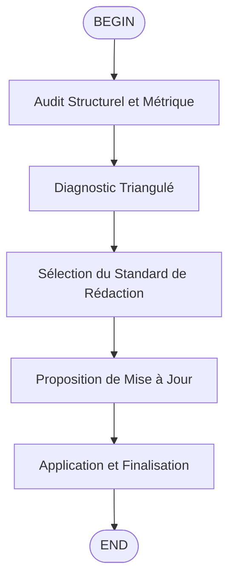

# `/flow:docs-updater` — Docs Updater Standardized & Metric-Driven

Ce workflow harmonise la documentation en utilisant l'analyse statique standard (`cloc`, `radon`, `tree`) pour la précision technique et les modèles de référence pour la qualité éditoriale.

## Protocoles Critiques

### Outils autorisés

L'usage de `Shell` est **strictement limité** aux commandes d'audit : `tree`, `cloc`, `radon`, `ls`.

### Contexte

Initialiser le contexte en appelant l'outil `fast_read_file` pour lire UNIQUEMENT `activeContext.md`. Ne lire les autres fichiers de la Memory Bank que si une divergence majeure est détectée lors du diagnostic.

### Source de Vérité

**Le Code (analysé par outils) > La Documentation existante > La Mémoire**

### Hiérarchie des Outils (Pull)

1. **Priority 1**: Utiliser `fast_read_file` du serveur MCP fast-filesystem.
2. **Priority 2 (Fallback)**: Si fast-filesystem non détecté, utiliser `Grep` pour chercher dans `./memory-bank/` puis `ReadFile`.
3. **Prohibition**: Ne jamais charger plus d'un fichier à la fois.

---

## Étape 1 — Audit Structurel et Métrique

Lancer les commandes suivantes configurées pour **ignorer le template HTML massif** (`sticky_mobile_template`) :

### 1. Cartographie (Filtre Template UI)

```bash
tree -L 3 -I '__pycache__|venv|node_modules|.git|sticky_mobile_template|debug|docs|memory-bank|.shrimp_task_manager'
```

*But*: Visualiser clairement l'app Flask (`switchbot_dashboard`) et les scripts de migration DB.

### 2. Volumétrie Étendue

```bash
cloc . --exclude-dir=sticky_mobile_template,tests,docs,venv,debug,memory-bank,.continue,.windsurf,.shrimp_task_manager --include-ext=py,sh,sql --md
```

*But*: Quantifier le backend Python, scripts shell et SQL.

### 3. Complexité Cyclomatique

```bash
radon cc switchbot_dashboard app.py scripts -a -nc
```

*But*: Identifier les points de fragilité dans les modules principaux.
**Cibles probables**: `automation.py` et `switchbot_api.py` (gestion des retries/quotas API).

### 4. Analyse de Dépendances

```bash
grep -r '^import|^from' --include='*.py' . --exclude-dir=venv,__pycache__,node_modules,.git,sticky_mobile_template,tests,docs,memory-bank,.shrimp_task_manager | head -50
```

*But*: Détecter les scripts isolés via leurs imports.

---

## Étape 2 — Diagnostic Triangulé

Comparer les sources pour détecter les incohérences :

| Source | Rôle | Outil |
| :--- | :--- | :--- |
| **Intention** | Le "Pourquoi" | `fast_read_file` |
| **Réalité** | Le "Quoi" & "Comment" | `radon`, `cloc`, `Grep` |
| **Existant** | L'état actuel | `Glob`, `ReadFile` |

**Action**: Identifier les divergences. Ex: "Le script `migrate_to_postgres.py` existe, mais la doc `docs/core/deployment.md` le marque comme 'à faire'."

---

## Étape 3 — Sélection du Standard de Rédaction

Choisir le modèle approprié selon la nature du module :

### IoT & Intégration (`switchbot_dashboard/`, `switchbot_api.py`)
- **Quotas & Limites**: Documenter les limites API (ex: 100 req/jour).
- **Gestion d'erreur**: Que se passe-t-il si le device est hors ligne ?

### Automation & Scheduling (`scheduler.py`, `automation.py`)
- **Logique d'État**: Comment `state.json` est-il mis à jour ?
- **Triggers**: Conditions de déclenchement (Température > X).

### Database & Ops (`scripts/`, `config/`)
- **Migration**: Étapes SQL (`schema.sql`).
- **Secrets**: Liste des clés requises dans `settings.json`.

---

## Étape 4 — Proposition de Mise à Jour

Générer un plan de modification avant d'appliquer :

```markdown
## 📝 Plan de Mise à Jour Documentation

### Audit Métrique
- **Cible**: `switchbot_dashboard/quota.py`
- **Analyse**: Gestion critique des limites API, non documentée.

### Modifications Proposées
#### 📄 docs/architecture/quota-management.md
- **Type**: [IoT Integration]
- **Ajout**: Tableau des limites API officielles vs implémentées.
```

---

## Étape 5 — Application et Finalisation

### 1. Exécution

Après validation, utiliser `WriteFile` ou `StrReplaceFile`.

### 2. Mode Rédaction — skill:documentation

- Charger immédiatement `.agents/skills/documentation/SKILL.md`.
- Appliquer les checkpoints obligatoires (TL;DR, ouverture orientée problème, comparaison ❌/✅, tableau de trade-offs, Golden Rule).

### 3. Mise à jour Memory Bank

- Utiliser `WriteFile` avec chemins absolus vers `/home/kidpixel/SwitchBot/memory-bank/`.
- Si des règles métier cachées (hardcoded) sont trouvées, les extraire ou les documenter dans `systemPatterns.md`.

---

## Exemple d'utilisation

```
/flow:docs-updater
```

L'agent exécutera l'audit complet et proposera des mises à jour documentation.
