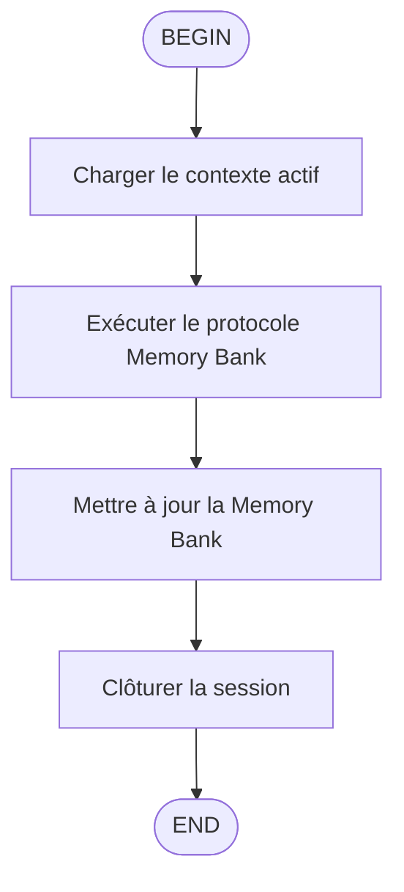

# `/flow:end` — Terminer la session et synchroniser la Memory Bank

Ce skill guide la fermeture propre d'une session de travail avec synchronisation complète de la Memory Bank.

## Processus de Fin de Session

### 1. Charger le contexte minimal

- Utilisez l'outil `fast_read_file` pour lire UNIQUEMENT `activeContext.md` et `progress.md` pour le résumé de session.
- NE PAS lire `productContext.md`, `systemPatterns.md` ou `decisionLog.md` sauf si une décision architecturale majeure a été prise.
- Si d'anciennes décisions doivent être revues, utilisez la recherche ciblée plutôt que de charger des fichiers entiers.

### 2. Exécuter le protocole Memory Bank

Référencez `.clinerules/memorybankprotocol.md` ou `.windsurf/rules/memorybankprotocol.md` :

- Suspendre la tâche en cours puis résumer la session.
- Utiliser `Grep` ou `search` pour identifier les fichiers additionnels à consulter.
- Documenter les décisions, progrès et contexte actif selon le protocole.

### 3. Mettre à jour la Memory Bank

- Mettre à jour les fichiers avec l'outil `WriteFile` ou `StrReplaceFile`.
- Avant chaque modification, lire la section pertinente avec `ReadFile` ou `fast_read_file` pour minimiser les changements.
- Chemins absolus recommandés : `/home/kidpixel/SwitchBot/memory-bank/`

### 4. Clôturer la session

- Résumer les tâches finalisées dans la réponse utilisateur.
- Vérifier avec `fast_read_file` que `progress.md` indique "Aucune tâche active".
- Vérifier que `activeContext.md` est revenu à l'état neutre.

## Hiérarchie des Outils (Pull)

1. **Priority 1** : Utiliser `fast_read_file` depuis le serveur MCP fast-filesystem.
2. **Priority 2 (Fallback)** : Si fast-filesystem non détecté, utiliser `ReadFile` ou `Grep` pour les fichiers memory-bank.
3. **Prohibition** : Ne jamais charger plus d'un fichier à la fois.

## Mode Token-Saver

Minimiser l'utilisation du contexte en utilisant les outils au lieu du pré-chargement. Accédez aux fichiers memory-bank avec des chemins absolus.

## Exemple d'utilisation

```
/flow:end
```

L'agent exécutera alors le protocole de fermeture de session complet.
