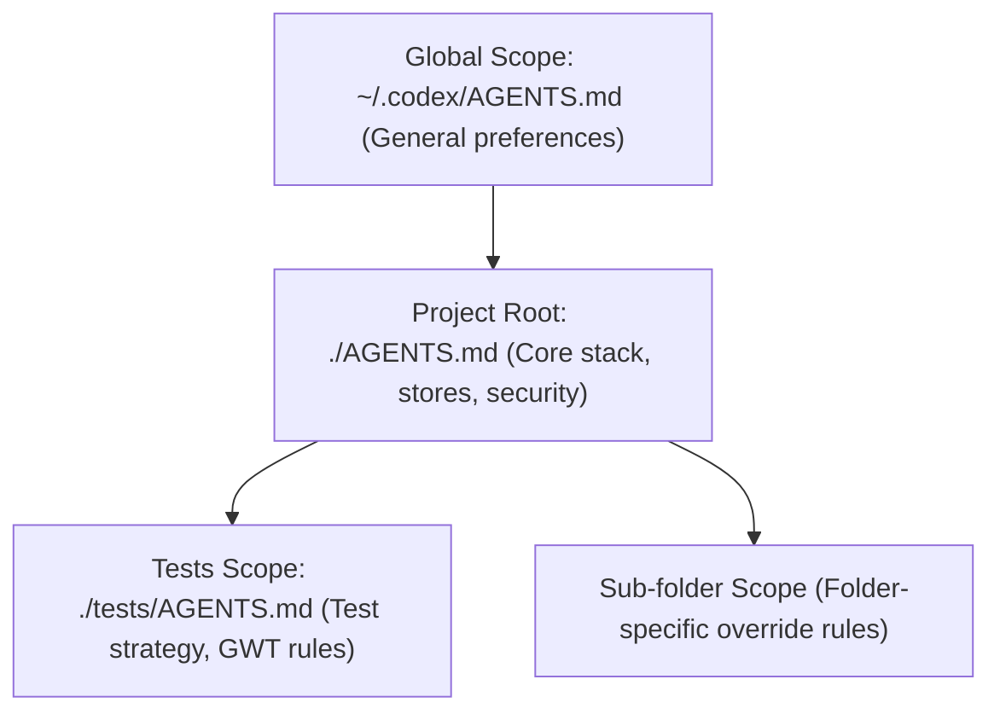

# Codex Integration and Configuration Guide

**TL;DR**: Transitioning to Codex requires shifting from interactive permissions to **declarative Starlark policies** and managing the 32 KiB instruction budget using **hierarchical custom instructions** and explicit skill scoping.

---

## The Migration Dilemma: Moving to Codex

You are configuring a local workspace for developing the SwitchBot Dashboard v2. You start Codex, run a quick test with `pytest`, or edit a configuration file. Instantly, you are blocked: either you get continuous interactive prompt warnings, or you hit strict security boundaries. 

The issue is that the agent system needs to run commands and access project files, but its runtime rules are designed for a different ecosystem. To solve this, we must map our existing Windsurf configuration into Codex's Starlark rules, `AGENTS.md` instructions, and Open Agent Skills.

---

## 1. Security & Command Approvals: Interactive vs Declarative

The security models of Windsurf and Codex handle command execution differently. Windsurf relies on interactive runtime checks; Codex uses a declarative gating engine.

### ❌ Windsurf: Interactive Escalation (`ask_permission`)
In Windsurf, when an agent requests a command execution outside the sandbox, the IDE halts and prompts the user. If the permission fails, the agent must programmatically request permission via a tool call. There is no local, checked-in configuration to pre-approve repetitive development commands like testing or environment activation.

### ✅ Codex: Declarative Sandbox Gates (`prefix_rule`)
Codex uses Starlark-based `.rules` files stored under `.codex/rules/` to evaluate commands at startup. This enables developers to declare which commands are safe, which require confirmation, and which are forbidden. The engine parses compound commands (like `cmd1 && cmd2`) using tree-sitter to prevent shell smuggling.

### Starlark Rule Implementation

We have created the local policy file [.codex/rules/development.rules](file:///home/kidpixel/SwitchBot/.codex/rules/development.rules) to authorize common development workflows:

```python
# .codex/rules/development.rules

# Activate the virtualenv
prefix_rule(
    pattern = [["source", "."], "/mnt/venv_ext4/venv_switchbot/bin/activate"],
    decision = "allow",
    justification = "Allow activating the Python virtual environment",
)

# Run pytest unit tests
prefix_rule(
    pattern = [["python", "python3"], "-m", "pytest"],
    decision = "allow",
    justification = "Allow running tests via pytest",
)
```

---

## 2. Instruction Layering & Budget Management

Codex aggregates instructions from `~/.codex/AGENTS.md` down to the current working directory, up to a default limit of 32 KiB (`project_doc_max_bytes`). 

Because our core rules (style, testing, security, memory bank) exceed 44 KB, a single root file will trigger truncation. We solve this by using Codex's hierarchical directory overrides.



### Folder-Specific Override Pattern

We split our rules into two layers:
1. **Root Layer**: [AGENTS.md](file:///home/kidpixel/SwitchBot/AGENTS.md) contains tech stack, store selection, core security, and memory bank protocol rules.
2. **Sub-folder Layer**: [tests/AGENTS.md](file:///home/kidpixel/SwitchBot/tests/AGENTS.md) contains test strategy, boundary value tables, and Given/When/Then requirements. Codex loads this only when execution runs in the `tests/` directory.

---

## 3. Skills Compatibility & MCP Integration

Our existing skills under `.agents/skills/` are fully compatible with the Open Agent Skills specification. They use the standard `SKILL.md` format with YAML frontmatter containing `name` and `description`.

### Local Skills Matrix vs Codex Triggering

| System | Triggering Mechanism | Tool Integration |
| :--- | :--- | :--- |
| **Windsurf** | Custom regex matchers in `.agents/rules/skills-integration.md` | Eagerly loaded IDE tools |
| **Codex** | Progressive disclosure (2% context budget) + Explicit/Implicit triggers | Configured via `agents/openai.yaml` dependencies |

### Optimizing Skills for Codex

To integrate skills smoothly under Codex:

1. **Deactivate Implicit Invocation**: For critical or context-heavy skills (e.g., `postgres-store-maintenance`, `shrimp-task-manager`), create `agents/openai.yaml` to prevent Codex from auto-triggering them. This saves prompt space and prevents execution loops.
2. **Declare local MCP tools**: Expose our project-specific MCP servers inside the skill dependencies.

#### YAML Metadata Example (`.agents/skills/postgres-store-maintenance/agents/openai.yaml`):
```yaml
interface:
  display_name: "PostgreSQL Store Maintenance"
  short_description: "Manage migrations, fallbacks, and psycopg pool health"

policy:
  allow_implicit_invocation: false # Must be invoked explicitly via $postgres-store-maintenance

dependencies:
  tools:
    - type: "mcp"
      value: "switchbot-postgres"
      description: "Postgres schema operations and diagnostics server"
```

---

## 4. Local Setup Action Plan

Follow this checklist to configure your local Codex environment:

### Step 1: Initialize User Layer
Ensure the global configuration directory exists on your machine:
```bash
mkdir -p ~/.codex/rules
```

### Step 2: Configure fallback and bytes limit
Update your global Codex configuration (`~/.codex/config.toml`) to increase the byte budget and define fallback file names:
```toml
# ~/.codex/config.toml
project_doc_max_bytes = 65536
project_doc_fallback_filenames = ["TEAM_GUIDE.md", ".agents.md"]
```

### Step 3: Validate local Starlark policy
Verify that your rules correctly allow your development commands:
```bash
codex execpolicy check --rules .codex/rules/development.rules -- python -m pytest tests/test_automation.py
```

---

## The Golden Rule: Declarative Gates, Scoped Context
Keep sandbox rules **declarative and strict** to eliminate developer prompts; layer instructions and skills **hierarchically** to stay within token budgets.
