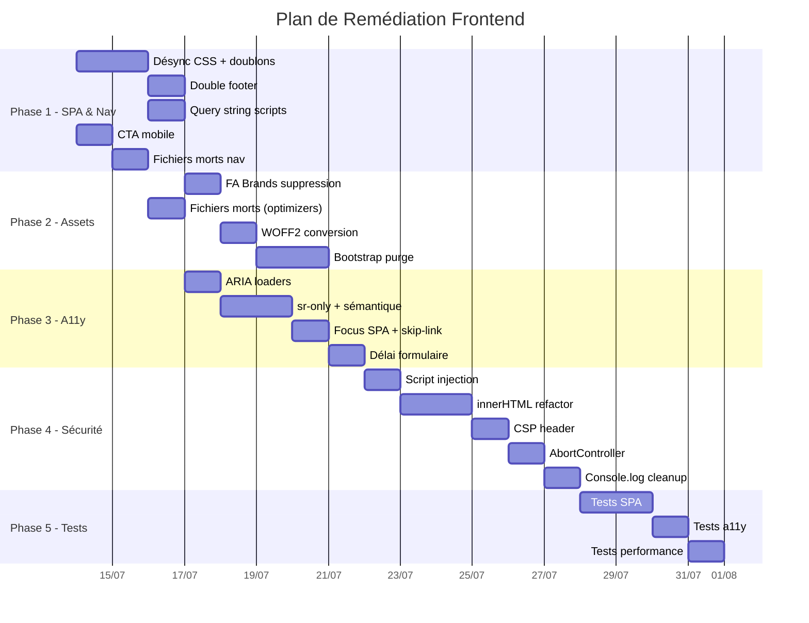

# Plan de Remédiation Frontend — SwitchBot Dashboard v2

**Date :** 2026-07-12
**Source :** [audit_frontend.md](file:///home/kidpixel/SwitchBot/docs/audits/audit_frontend.md)
**Portée :** 18 constats (3 P1, 6 P2, 7 P3) couvrant SPA, performance, accessibilité, sécurité et tests

---

## TL;DR

Le backend est solide (5 phases, 166 tests, 100% vert). **Le frontend est le prochain levier d'amélioration.** Ce plan en 5 phases corrige les 18 anomalies identifiées par l'audit. Les gains attendus :

| Métrique | Avant | Après (estimé) | Gain |
|---|---|---|---|
| Poids page d'accueil | ~800 Ko | ~450 Ko | −44% |
| Requêtes HTTP mortes | 4 (2 optimizers + bottom-nav + perf-worker) | 0 | −4 requêtes |
| Font Awesome (brands) | 320 Ko chargés pour 0 icône | 0 Ko | −320 Ko |
| Space Grotesk (TTF→WOFF2) | 204 Ko | ~90 Ko | −56% |
| Conformité WCAG 2.1 AA | Partielle (8 non-conformités) | Complète | ✅ |
| Score CSS coverage | ~30% | ~60%+ | +100% |
| Tests frontend | 6 (surfaces uniquement) | 20+ (SPA, responsive, a11y) | +233% |

---

## Phase 1 : Routage SPA & Mécanismes de Navigation

**Priorité :** Immédiate
**Risque actuel :** Les bugs SPA provoquent des doublons CSS, des fuites mémoire dans les interceptors CSRF, et un double footer dans le DOM.

### 1.1 — Désynchronisation CSS et duplication de preload links (P1.1)

**Problème.** Le routeur injecte de nouvelles `<link>` sans vérifier les doublons. Les feuilles globales (`theme.css`, `bootstrap.min.css`, `sticky-footer.css`, `sticky-cards.css`) s'accumulent dans le `<head>` à chaque navigation SPA. Les `<link rel="preload" as="style">` sont aussi re-injectés.

**Fichiers impactés :**
- [spa-router.js](file:///home/kidpixel/SwitchBot/switchbot_dashboard/static/js/spa-router.js) — lignes 80-114

**Spécification technique :**

❌ Comportement actuel :
```javascript
// Le routeur ne filtre que les CSS page-specific au retrait
const pageSpecificCSSPattern = /\/static\/css\/(index|settings|actions|history|devices)\.css(\?.*)?$/;
// Les globales sont re-injectées sans vérification de doublons
```

✅ Comportement cible :
```javascript
// 1. Normaliser les URLs avant comparaison (ignorer query strings)
const normalizeHref = (href) => new URL(href, location.origin).pathname;

// 2. Construire un Set des CSS déjà présentes dans le document
const existingCSS = new Set(
  Array.from(document.querySelectorAll('link[rel="stylesheet"]'))
    .map(link => normalizeHref(link.getAttribute('href')))
    .filter(Boolean)
);

// 3. N'injecter que les feuilles absentes du Set
newStyleLinks.forEach(link => {
  const href = link.getAttribute('href');
  if (!href) return;
  const normalized = normalizeHref(href);
  if (existingCSS.has(normalized)) return; // Skip doublon
  // ... injecter la feuille
  existingCSS.add(normalized);
});

// 4. Supprimer les preload links orphelins avant injection
document.querySelectorAll('link[rel="preload"][as="style"]').forEach(pl => {
  const plPath = normalizeHref(pl.getAttribute('href'));
  if (!newCSSUrls.includes(plPath)) pl.remove();
});
```

| Approche | Doublons CSS | Preload orphelins | Complexité |
|---|---|---|---|
| Filtre par pattern (actuel) | ❌ Persiste sur globales | ❌ Non géré | Faible |
| Set de normalisation (cible) | ✅ Éliminé | ✅ Nettoyé | Moyenne |
| HTMX/fragments serveur | ✅ Éliminé par design | ✅ N/A | Élevée (refonte) |

**Choix retenu :** Set de normalisation — compromis optimal entre correction complète et impact minimal sur l'architecture existante.

### 1.2 — Double navigation footer (P1.1)

**Problème.** `_footer_nav.html` est inclus via `` dans chaque template. Le `#footer-bar` se trouve **en dehors** de `#app-content`. Quand le routeur remplace `#app-content`, le footer existant reste en place, et si le nouveau contenu HTML contient aussi un footer (car le template complet est servi), il y a temporairement deux footers.

**Fichiers impactés :**
- [spa-router.js](file:///home/kidpixel/SwitchBot/switchbot_dashboard/static/js/spa-router.js) — ligne 137
- [_footer_nav.html](file:///home/kidpixel/SwitchBot/switchbot_dashboard/templates/_footer_nav.html)

**Spécification technique :**

```javascript
// Après remplacement de #app-content, supprimer tout footer en double
const existingFooter = document.getElementById('footer-bar');
const newFooter = currentContent.querySelector('#footer-bar');
if (newFooter && existingFooter && newFooter !== existingFooter) {
  newFooter.remove(); // Le footer hors #app-content est le bon
}
```

Alternative structurelle : s'assurer que `#footer-bar` est **toujours en dehors** de `#app-content` dans les templates, ce qui élimine le problème à la source. Vérifier chaque template pour confirmer cette hypothèse.

### 1.3 — Re-exécution des scripts globaux via query strings (P1.1)

**Problème.** Le filtre `globalScripts` utilise `src.endsWith('loaders.js')`, mais si un script a un cache-buster `?v=123`, `endsWith` échoue. Les interceptors CSRF dans `loaders.js` seraient re-installés en couche, chaque `fetch` passant par N interceptors chaînés.

**Fichiers impactés :**
- [spa-router.js](file:///home/kidpixel/SwitchBot/switchbot_dashboard/static/js/spa-router.js) — lignes 12-19, 218-226

**Spécification technique :**

❌ Actuel :
```javascript
const isGlobal = this.globalScripts.some(gs => src.endsWith(gs));
```

✅ Cible :
```javascript
// Extraire le pathname sans query string pour la comparaison
const srcPath = new URL(src, location.origin).pathname;
const isGlobal = this.globalScripts.some(gs => srcPath.endsWith(gs));
```

### 1.4 — CTA collant chevauche le footer mobile (P1.2)

**Problème.** Sur un écran 375px, le `.scene-actions-wrapper` sticky se positionne à 75px du bas, le footer fait 62px : il reste 13px de marge, insuffisante pour le contenu du CTA (padding + bouton 56px). Le `margin: 1rem -1rem -1rem` provoque un débordement horizontal de 16px.

**Fichiers impactés :**
- [index.css](file:///home/kidpixel/SwitchBot/switchbot_dashboard/static/css/index.css) — lignes 159-176
- [critical.css](file:///home/kidpixel/SwitchBot/switchbot_dashboard/static/css/critical.css) — lignes 236-247
- CSS inline dans [index.html](file:///home/kidpixel/SwitchBot/switchbot_dashboard/templates/index.html)

**Spécification technique :**

```css
/* Corriger le calcul de position pour tenir compte de la hauteur réelle du footer */
.scene-actions-wrapper {
  position: sticky;
  bottom: calc(var(--sb-footer-height, 62px) + env(safe-area-inset-bottom) + 1rem);
  margin: 1rem 0; /* Supprimer les marges négatives horizontales */
  z-index: 1020; /* En dessous du footer (1030) */
}
```

Définir `--sb-footer-height: 62px` dans `:root` de `theme.css` pour centraliser la valeur.

### 1.5 — Fichier mort `bottom-nav.js` et incohérence desktop/mobile (P2.4, P3.4)

**Problème.** `bottom-nav.js` (141 lignes) cible `.sb-bottom-nav` qui n'existe dans aucun template. Le fichier est 100% mort. Par ailleurs, trois sources CSS contradictoires gèrent la visibilité du footer sur desktop.

**Fichiers impactés :**
- [bottom-nav.js](file:///home/kidpixel/SwitchBot/switchbot_dashboard/static/js/bottom-nav.js) — fichier entier (à supprimer)
- [critical.css](file:///home/kidpixel/SwitchBot/switchbot_dashboard/static/css/critical.css) — lignes 418-426
- [sticky-footer.css](file:///home/kidpixel/SwitchBot/switchbot_dashboard/static/css/sticky-footer.css) — lignes 12-35
- [theme.css](file:///home/kidpixel/SwitchBot/switchbot_dashboard/static/css/theme.css) — lignes 695-703
- Templates chargeant `bottom-nav.js` (retirer les `<script>`)

**Actions :**
1. Supprimer `bottom-nav.js` du dépôt.
2. Retirer les `<script src="bottom-nav.js">` de tous les templates.
3. Retirer `bottom-nav.js` de la liste `globalScripts` dans `spa-router.js`.
4. Consolider la visibilité desktop du footer : choisir **une seule source** (recommandation : `sticky-footer.css`). Supprimer les règles mortes dans `critical.css` inline et la règle `.sb-bottom-nav` dans `theme.css`.

**Validation :**
- Test visuel mobile (375px) et desktop (1280px) : le footer est visible/masqué selon l'intention design.
- Vérifier qu'aucun `console.error` n'apparaît lié à `BottomNavigation`.

---

## Phase 2 : Optimisation des Assets & Performance

**Priorité :** Court terme
**Gains attendus :** ~350 Ko de bande passante économisée, −4 requêtes HTTP mortes.

### 2.1 — Élimination de Font Awesome Brands inutilisé (P1.3)

**Problème.** `fa-brands-400` (TTF 204 Ko + WOFF2 117 Ko = 321 Ko) est chargé mais aucune icône brand n'est utilisée dans le projet. Seules des icônes `fa-solid` sont présentes.

**Fichiers impactés :**
- [all.min.css](file:///home/kidpixel/SwitchBot/switchbot_dashboard/static/vendor/fontawesome/css/all.min.css)
- `vendor/fontawesome/webfonts/fa-brands-400.ttf` (à supprimer)
- `vendor/fontawesome/webfonts/fa-brands-400.woff2` (à supprimer)

**Spécification technique :**

| Approche | Poids | Maintenance | Risque |
|---|---|---|---|
| Subsetting FA (fonttools) | ~30 Ko WOFF2 | Moyen (rebuild si nouvelles icônes) | Faible |
| SVG inline pour 15 icônes | ~5 Ko total | Faible (auto-contenu) | Très faible |
| Retrait brands + garder solid complet | −321 Ko | Nul | Très faible |

**Choix retenu :** Retrait des fichiers brands + nettoyage de `all.min.css` pour supprimer la déclaration `@font-face` de `fa-brands-400`. C'est le gain le plus immédiat. Le subsetting de `fa-solid` est optionnel (Phase 5).

**Actions :**
1. Supprimer `fa-brands-400.ttf` et `fa-brands-400.woff2`.
2. Éditer `all.min.css` pour retirer le bloc `@font-face` de Font Awesome Brands.
3. Supprimer `fa-solid-900.ttf` (le WOFF2 suffit pour tous les navigateurs modernes).

### 2.2 — Suppression des optimiseurs fantômes et fichiers morts (P2.2, P3.1)

**Problème.** `performance-optimizer.js` (30 lignes, no-op) et `advanced-optimizer.js` (29 lignes, no-op) ne font qu'un `console.log`. `perf-worker.js` (99 lignes) n'est référencé nulle part. `critical.css` (418 lignes) est identique au CSS inline de `index.html`.

**Fichiers à supprimer :**
- [performance-optimizer.js](file:///home/kidpixel/SwitchBot/switchbot_dashboard/static/js/performance-optimizer.js)
- [advanced-optimizer.js](file:///home/kidpixel/SwitchBot/switchbot_dashboard/static/js/advanced-optimizer.js)
- [perf-worker.js](file:///home/kidpixel/SwitchBot/switchbot_dashboard/static/js/perf-worker.js)
- [critical.css](file:///home/kidpixel/SwitchBot/switchbot_dashboard/static/css/critical.css)

**Actions :**
1. Supprimer les 4 fichiers du dépôt.
2. Retirer les `<script>` correspondants de `index.html` et `settings.html`.
3. Retirer `performance-optimizer.js` et `advanced-optimizer.js` de la liste `globalScripts` dans `spa-router.js`.

### 2.3 — Conversion des polices Space Grotesk en WOFF2 (P2.6, P3.5)

**Problème.** Les 3 fichiers Space Grotesk sont en TTF (3 × 68 Ko = 204 Ko). Le format WOFF2 est 30-50% plus petit et supporté par tous les navigateurs ciblés.

**Fichiers impactés :**
- `vendor/fonts/SpaceGrotesk-Regular.ttf` → `.woff2`
- `vendor/fonts/SpaceGrotesk-Medium.ttf` → `.woff2`
- `vendor/fonts/SpaceGrotesk-SemiBold.ttf` → `.woff2`
- [theme.css](file:///home/kidpixel/SwitchBot/switchbot_dashboard/static/css/theme.css) — déclarations `@font-face`

**Spécification technique :**
1. Convertir les TTF en WOFF2 via `fonttools` (outil Python) ou `woff2_compress`.
2. Mettre à jour les `@font-face` dans `theme.css` pour pointer vers les `.woff2`.
3. Supprimer les fichiers `.ttf` originaux.
4. Corriger la référence `font-family: "Roboto"` dans `sticky-footer.css:83` → remplacer par `font-family: inherit` ou `var(--sb-font-family)` (P2.6).

### 2.4 — Purge des classes CSS inutilisées de Bootstrap (P3.14)

**Problème.** `bootstrap.min.css` pèse 228 Ko mais le projet utilise environ 20% des classes. Le CSS coverage est à ~30%.

**Fichiers impactés :**
- [bootstrap.min.css](file:///home/kidpixel/SwitchBot/switchbot_dashboard/static/vendor/css/bootstrap.min.css) (228 Ko)

| Approche | Poids résultant | Effort | Risque |
|---|---|---|---|
| PurgeCSS en CLI ponctuel | ~60-80 Ko | Faible (script one-shot) | Moyen (faux positifs possibles) |
| Build Bootstrap custom | ~50-70 Ko | Moyen (config SCSS) | Faible |
| Statu quo | 228 Ko | Nul | Nul |

**Choix retenu :** PurgeCSS en CLI ponctuel, avec test visuel complet avant remplacement. Les classes dynamiques (ajoutées par JS comme `show`, `fade`, `active`, `collapse`) doivent être safelist-ées.

**Protocole :**
1. Exécuter PurgeCSS avec les templates HTML + fichiers JS comme contenu.
2. Safelist : `show`, `fade`, `active`, `collapse`, `collapsing`, `modal-*`, `alert-*`, `btn-close`, `form-check-*`.
3. Comparer visuellement toutes les pages avant/après.
4. Remplacer `bootstrap.min.css` uniquement si aucune régression visuelle.

**Validation :** Test visuel de chaque page (index, settings, actions, history, devices, quota, login, 503).

---

## Phase 3 : Accessibilité (WCAG 2.1 AA) & Conformité UX

**Priorité :** Court/Moyen terme
**Objectif :** Atteindre la conformité WCAG 2.1 niveau AA sur toutes les pages.

### 3.1 — Réparation de l'état `aria-hidden` des loaders (P2.1)

**Problème.** L'overlay local est créé avec `aria-hidden="true"`. Quand `showLoader()` l'active, il change `aria-hidden` en `"false"` via `requestAnimationFrame`, mais le `role="status"` du spinner est à l'intérieur d'un parent qui était `aria-hidden` au rendu initial. Les lecteurs d'écran peuvent ignorer ce changement dynamique. Le loader global a le même défaut.

**Fichiers impactés :**
- [loaders.js](file:///home/kidpixel/SwitchBot/switchbot_dashboard/static/js/loaders.js) — lignes 93-111, 113-136

**Spécification technique :**

❌ Actuel :
```javascript
overlay.setAttribute('aria-hidden', 'true');
// ... plus tard dans showLoader :
overlay.setAttribute('aria-hidden', 'false'); // Changement ignoré par certains AT
```

✅ Cible :
```javascript
// 1. Ne pas mettre aria-hidden sur le conteneur du spinner
// 2. Ajouter une région aria-live séparée pour les annonces
const liveRegion = document.createElement('div');
liveRegion.setAttribute('aria-live', 'polite');
liveRegion.setAttribute('aria-atomic', 'true');
liveRegion.className = 'sr-only';
document.body.appendChild(liveRegion);

// Dans showLoader() :
liveRegion.textContent = 'Chargement en cours...';
overlay.removeAttribute('aria-hidden');

// Dans hideLoader() :
liveRegion.textContent = 'Chargement terminé.';
overlay.setAttribute('aria-hidden', 'true');
```

### 3.2 — Définition globale de `.sr-only` (P2.5)

**Problème.** La classe `.sr-only` est utilisée dans `loaders.js` et `history.html` mais n'est définie dans aucun CSS custom. Elle dépend de `bootstrap.min.css` qui est chargé en asynchrone sur `index.html`, provoquant un flash de texte visible.

**Fichiers impactés :**
- [theme.css](file:///home/kidpixel/SwitchBot/switchbot_dashboard/static/css/theme.css) (ajouter la définition)
- CSS inline de [index.html](file:///home/kidpixel/SwitchBot/switchbot_dashboard/templates/index.html) (ajouter aussi)

**Spécification technique :**

Ajouter dans `theme.css` (et dans le CSS inline critique de `index.html`) :

```css
.sr-only,
.visually-hidden {
  position: absolute;
  width: 1px;
  height: 1px;
  padding: 0;
  margin: -1px;
  overflow: hidden;
  clip: rect(0, 0, 0, 0);
  white-space: nowrap;
  border: 0;
}
```

> [!NOTE]
> Bootstrap 5 utilise `.visually-hidden` plutôt que `.sr-only`. Les deux alias sont définis pour compatibilité maximale.

### 3.3 — Structuration sémantique (P3.2, P3.3, P2.27, P2.28)

**Problème.** Multiples lacunes sémantiques : hiérarchie de titres cassée dans `settings.html`, landmarks `<main>` manquants sur `login.html` et `503.html`, pas de skip-link, pas de `scope` sur les `<th>` de la table history, icônes décoratives sans `aria-hidden`.

**Fichiers impactés :**
- [settings.html](file:///home/kidpixel/SwitchBot/switchbot_dashboard/templates/settings.html) — lignes 348, 403 (`h2` → `h3`)
- [login.html](file:///home/kidpixel/SwitchBot/switchbot_dashboard/templates/login.html) — ajouter `<main>`
- [503.html](file:///home/kidpixel/SwitchBot/switchbot_dashboard/templates/503.html) — ajouter `<main>`
- [history.html](file:///home/kidpixel/SwitchBot/switchbot_dashboard/templates/history.html) — ajouter `scope="col"` sur `<th>`
- [_footer_nav.html](file:///home/kidpixel/SwitchBot/switchbot_dashboard/templates/_footer_nav.html) — ajouter `aria-hidden="true"` sur les `<i>` Font Awesome
- Tous les templates — ajouter un skip-link

**Spécification technique :**

```html
<!-- Skip-link : à ajouter en premier enfant de <body> dans chaque template -->
<a href="#app-content" class="sr-only" style="position:absolute;top:-999px;left:-999px;z-index:9999">
  Aller au contenu principal
</a>

<!-- settings.html : corriger la hiérarchie -->
<!-- Ligne 348 : <h2>Profil hiver</h2> → <h3>Profil hiver</h3> -->
<!-- Ligne 403 : <h2>Profil été</h2> → <h3>Profil été</h3> -->

<!-- login.html / 503.html : envelopper le contenu dans <main> -->
<main id="app-content" class="sb-page__content">
  <!-- contenu existant -->
</main>

<!-- history.html : ajouter scope sur les th -->
<th scope="col">Horodatage</th>
<th scope="col">Température</th>
<!-- etc. -->
```

### 3.4 — Gestion du focus après transition SPA (P2.26)

**Problème.** Après une navigation SPA, le focus reste sur le lien cliqué dans le footer. Les utilisateurs de clavier et de lecteurs d'écran ne sont pas informés du changement de contenu.

**Fichiers impactés :**
- [spa-router.js](file:///home/kidpixel/SwitchBot/switchbot_dashboard/static/js/spa-router.js) — après ligne 162

**Spécification technique :**

```javascript
// Après le remplacement du contenu (ligne 162) :
// 1. Déplacer le focus vers le conteneur principal
const mainContent = document.getElementById('app-content');
if (mainContent) {
  mainContent.setAttribute('tabindex', '-1');
  mainContent.focus({ preventScroll: true });
}

// 2. Annoncer le changement de page via aria-live
const announcer = document.getElementById('spa-route-announcer') 
  || (() => {
    const el = document.createElement('div');
    el.id = 'spa-route-announcer';
    el.setAttribute('aria-live', 'assertive');
    el.setAttribute('aria-atomic', 'true');
    el.className = 'sr-only';
    document.body.appendChild(el);
    return el;
  })();
announcer.textContent = `Page chargée : ${document.title}`;
```

### 3.5 — Suppression du délai artificiel de 1s (P3.18)

**Problème.** `loaders.js:233` impose un `setTimeout(() => { form.submit(); }, 1000)` avant la soumission réelle du formulaire. Ce délai artificiel dégrade l'UX sans justification technique.

**Fichiers impactés :**
- [loaders.js](file:///home/kidpixel/SwitchBot/switchbot_dashboard/static/js/loaders.js) — lignes 233-235

**Spécification technique :**

❌ Actuel :
```javascript
setTimeout(() => {
    form.submit();
}, 1000);
```

✅ Cible :
```javascript
// Soumettre immédiatement après l'affichage du loader
requestAnimationFrame(() => {
    form.submit();
});
```

Ajuster le `setTimeout(finalizeSubmission, 10000)` (ligne 243) en conséquence : le réduire à 5000 ms pour s'aligner avec le failsafe de 15s.

---

## Phase 4 : Sécurité Frontend & Robustesse Dynamique

**Priorité :** Moyen terme
**Objectif :** Éliminer les vecteurs XSS potentiels et renforcer la résilience des appels réseau.

### 4.1 — Sécurisation des injections de scripts dynamiques (P2.43)

**Problème.** `loadScriptDynamic()` crée des `<script>` avec le `src` du document parsé par `DOMParser`. Un attaquant qui contrôlerait la page destination (si le serveur est compromis) pourrait injecter un script arbitraire. De plus, le sélecteur `script[src="${src}"]` est vulnérable à l'injection de sélecteur CSS si l'URL contient des caractères spéciaux.

**Fichiers impactés :**
- [spa-router.js](file:///home/kidpixel/SwitchBot/switchbot_dashboard/static/js/spa-router.js) — lignes 241-251

**Spécification technique :**

❌ Actuel :
```javascript
loadScriptDynamic(src) {
    const existing = document.querySelector(`script[src="${src}"]`);
    if (existing) existing.remove();
    const newScript = document.createElement('script');
    newScript.src = src;
    // ...
}
```

✅ Cible :
```javascript
loadScriptDynamic(src) {
    // 1. Valider que le src est same-origin
    try {
        const url = new URL(src, location.origin);
        if (url.origin !== location.origin) {
            console.warn('[SPARouter] Blocked cross-origin script:', src);
            return;
        }
    } catch {
        console.warn('[SPARouter] Invalid script URL:', src);
        return;
    }

    // 2. Utiliser une comparaison sûre au lieu de querySelector avec interpolation
    const existingScripts = document.querySelectorAll('script[src]');
    existingScripts.forEach(s => {
        if (s.getAttribute('src') === src) s.remove();
    });

    const newScript = document.createElement('script');
    newScript.src = src;
    newScript.async = false;
    document.body.appendChild(newScript);
}
```

### 4.2 — Remplacement des `innerHTML` à risque (P2.3, P2.41)

**Problème.** `history.js` utilise `innerHTML` en 3 endroits (lignes 324, 361, 489, 519). Bien que le contenu soit statique (pas de données utilisateur interpolées), c'est un vecteur potentiel. Le routeur SPA utilise `innerHTML` à la ligne 137 pour remplacer le contenu de `#app-content`.

**Fichiers impactés :**
- [history.js](file:///home/kidpixel/SwitchBot/switchbot_dashboard/static/js/history.js) — lignes 324, 361, 489, 519
- [spa-router.js](file:///home/kidpixel/SwitchBot/switchbot_dashboard/static/js/spa-router.js) — ligne 137

**Spécification technique :**

Pour `history.js` :
- Ligne 519 (`formatAirconState`) : Le HTML vient d'un `stateMap` hardcodé. Refactorer pour utiliser `createElement` + `classList.add` + `textContent`.
- Ligne 489 (cellule vide) : Remplacer par `createElement('tr')` + `createElement('td')` + `textContent`.
- Lignes 324, 361 : Templates statiques. Convertir en création DOM impérative.

Pour `spa-router.js` ligne 137 :
- Le contenu provient de `DOMParser` sur un `fetch` same-origin. Le risque est faible mais réel si le serveur est compromis. **Conserver `innerHTML` ici** mais documenter le choix ; une alternative serait de remplacer les nodes enfants un par un, ce qui impacterait la performance sans gain significatif.

| Fichier | Ligne | Source des données | Risque XSS | Action |
|---|---|---|---|---|
| `history.js` | 324 | Template statique | Très faible | Refactorer en DOM API |
| `history.js` | 361 | Template statique | Très faible | Refactorer en DOM API |
| `history.js` | 489 | Template statique | Nul | Refactorer en DOM API |
| `history.js` | 519 | `stateMap` hardcodé | Nul | Refactorer en DOM API |
| `spa-router.js` | 137 | `fetch` same-origin | Faible | Conserver + documenter |

### 4.3 — Content-Security-Policy minimale (P3.16)

**Problème.** Aucun header CSP n'est défini. Les scripts inline et le CSS inline de `index.html` (418 lignes) empêchent une CSP stricte.

**Fichiers impactés :**
- Backend : `switchbot_dashboard/__init__.py` ou headers de sécurité existants
- [index.html](file:///home/kidpixel/SwitchBot/switchbot_dashboard/templates/index.html) — CSS inline

**Spécification technique :**

CSP minimale adaptée aux contraintes actuelles :
```
Content-Security-Policy: default-src 'self'; script-src 'self' 'unsafe-inline'; style-src 'self' 'unsafe-inline'; font-src 'self'; img-src 'self' data:; connect-src 'self'
```

> [!IMPORTANT]
> `'unsafe-inline'` est nécessaire tant que le CSS inline et les scripts inline de `index.html` existent. Une migration vers des nonces CSP est un objectif long terme.

| Directive | Valeur | Justification |
|---|---|---|
| `default-src` | `'self'` | Offline-first strict |
| `script-src` | `'self' 'unsafe-inline'` | Scripts inline dans templates |
| `style-src` | `'self' 'unsafe-inline'` | CSS inline critique |
| `font-src` | `'self'` | Polices locales uniquement |
| `img-src` | `'self' data:` | SVG inline encodés en data URI |
| `connect-src` | `'self'` | API same-origin uniquement |

### 4.4 — `AbortController` pour les requêtes history (P3.6)

**Problème.** Les `fetch()` vers `/history/api/*` n'ont pas de timeout. Le polling toutes les 30 secondes peut empiler les requêtes si le serveur est lent.

**Fichiers impactés :**
- [history.js](file:///home/kidpixel/SwitchBot/switchbot_dashboard/static/js/history.js) — lignes 343, 372, 381

**Spécification technique :**

```javascript
// Ajouter une propriété AbortController à la classe HistoryDashboard
constructor() {
    // ...
    this.activeController = null;
}

async loadHistoryData() {
    // Annuler la requête précédente si elle est encore en cours
    if (this.activeController) {
        this.activeController.abort();
    }
    this.activeController = new AbortController();
    const signal = this.activeController.signal;

    // Timeout de 10 secondes
    const timeoutId = setTimeout(() => this.activeController.abort(), 10000);

    try {
        const response = await fetch(`/history/api/data?${params}`, { signal });
        clearTimeout(timeoutId);
        // ...
    } catch (error) {
        clearTimeout(timeoutId);
        if (error.name === 'AbortError') {
            console.warn('[History] Request aborted (timeout or new request)');
            return;
        }
        throw error;
    } finally {
        this.activeController = null;
    }
}
```

### 4.5 — Nettoyage des `console.log` de debug (P3.17)

**Problème.** Des `console.log` de debug subsistent en production.

**Fichiers impactés :**
- [spa-router.js](file:///home/kidpixel/SwitchBot/switchbot_dashboard/static/js/spa-router.js) — ligne 28
- [history.js](file:///home/kidpixel/SwitchBot/switchbot_dashboard/static/js/history.js) — ligne 479

**Actions :**
1. Supprimer `console.log('🚀 SPA Light Router initialized')` (ligne 28).
2. Supprimer `console.log('Elements found:', !!tempElement, !!humidityElement)` (ligne 479).

---

## Phase 5 : Couverture de Tests Frontend & Validation

**Priorité :** Moyen/Long terme
**Objectif :** Passer de 6 tests de surface à 20+ tests couvrant les fonctionnalités critiques.

### 5.1 — Tests de non-régression ciblés (P3.7)

**Problème.** Les 6 tests existants vérifient uniquement la présence de classes CSS et de fonctions. Aucun test ne valide le comportement du routeur SPA, le responsive, l'accessibilité ou le polling history.

**Fichiers impactés :**
- [test_frontend_loaders.py](file:///home/kidpixel/SwitchBot/tests/test_frontend_loaders.py) (existant, à étendre)
- Nouveaux fichiers de test à créer

**Spécification technique :**

| Catégorie | Tests à écrire | Méthode |
|---|---|---|
| SPA Router | Pas de doublons CSS après 3 navigations | Analyse statique du JS + test d'intégration |
| SPA Router | Scripts globaux non re-exécutés avec `?v=` | Regex sur `globalScripts` filter |
| SPA Router | Fallback full-page sur erreur fetch | Mock de `fetch` + assertion `location.href` |
| Responsive | CTA mobile ne chevauche pas le footer | Vérification des valeurs CSS calc() |
| Accessibilité | `.sr-only` défini dans `theme.css` | `grep` sur le fichier CSS |
| Accessibilité | Skip-link présent dans chaque template | Parsing HTML |
| Accessibilité | `scope="col"` sur tous les `<th>` de `history.html` | Parsing HTML |
| Accessibilité | `aria-hidden="true"` sur les icônes décoratives du footer | Parsing HTML |
| Performance | Absence de fichiers morts (`critical.css`, `bottom-nav.js`, optimizers) | `os.path.exists` |
| Performance | `fa-brands-400` absent du dépôt | `os.path.exists` |
| Sécurité | Pas de `console.log` en production dans les JS critiques | `grep` sur les fichiers JS |
| Sécurité | `innerHTML` non utilisé avec des données dynamiques | Analyse statique |
| Cache scripts | Query string ignoré dans le filtre globalScripts | Regex sur le code JS |

**Structure des tests :**
```python
# tests/test_frontend_spa.py
class TestSPARouterSafety:
    """Tests de non-régression pour le routeur SPA."""

    def test_global_scripts_filter_handles_query_strings(self):
        """Le filtre globalScripts doit fonctionner même avec ?v=123."""

    def test_no_css_duplication_pattern(self):
        """Le routeur doit utiliser un Set normalisé pour les CSS."""

    def test_script_src_validation(self):
        """loadScriptDynamic doit valider l'origine du script."""

# tests/test_frontend_accessibility.py
class TestAccessibilityCompliance:
    """Tests WCAG 2.1 AA."""

    def test_sr_only_defined_in_theme_css(self):
        """La classe .sr-only doit être définie dans theme.css."""

    def test_skip_link_present(self):
        """Un skip-link doit être présent dans chaque template."""

    def test_main_landmark_on_all_pages(self):
        """Chaque page doit avoir un élément <main>."""

# tests/test_frontend_performance.py
class TestPerformanceAssets:
    """Tests de poids et de fichiers morts."""

    def test_no_dead_files(self):
        """Les fichiers morts identifiés dans l'audit ne doivent plus exister."""

    def test_no_fa_brands(self):
        """Font Awesome Brands ne doit plus être présent."""
```

**Validation globale :**
- Exécuter `python -m pytest tests/test_frontend_*.py -v`.
- Objectif : 100% des nouveaux tests passent après l'implémentation des phases 1-4.

---

## Calendrier & Dépendances



---

## Golden Rule

> **Corriger le routeur SPA en premier.** Tant que les doublons CSS, la re-exécution de scripts et le double footer persistent, toute optimisation d'assets ou de poids sera partiellement annulée par les fuites du routeur. Phase 1 est le prérequis de toutes les autres.

---

*Plan généré à partir de l'[audit frontend](file:///home/kidpixel/SwitchBot/docs/audits/audit_frontend.md) du 2026-07-12. Aucun fichier du dépôt n'a été modifié.*
